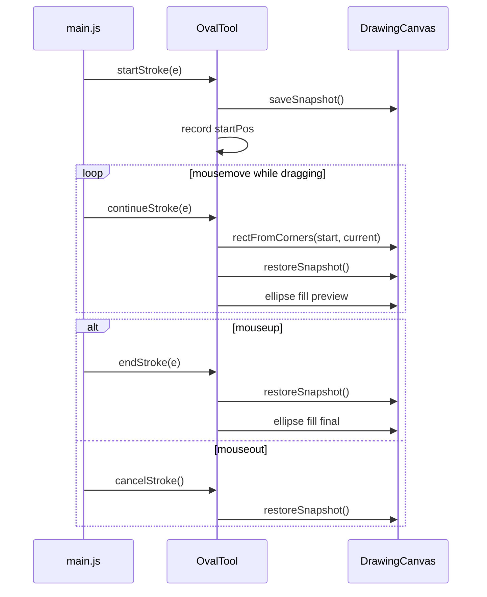

# Oval Drawing Tool Plan

## Requirements (inferred + confirmed)

- **Interaction:** Same as [rectangleTool.js](file:///Users/elainezhang/Desktop/UNSW/PROJECTS/canva/sturdy-broccoli/src/tools/rectangleTool.js) — mousedown sets first corner, drag updates preview, mouseup commits using opposite corners.
- **Geometry:** Ellipse **inscribed in the drag bounding box** (confirmed).
- **Appearance:** Filled shape, **no stroke/border**, black fill — consistent with rectangle and other tools.
- **Edge cases:** Zero-size click → nothing drawn; mouseout mid-drag → cancel preview (same as rectangle).

## Current codebase context

Already in place:

- [canvas.js](file:///Users/elainezhang/Desktop/UNSW/PROJECTS/canva/sturdy-broccoli/src/canvas.js) — `saveSnapshot`, `restoreSnapshot`, `clearSnapshot`, `rectFromCorners`
- [rectangleTool.js](file:///Users/elainezhang/Desktop/UNSW/PROJECTS/canva/sturdy-broccoli/src/tools/rectangleTool.js) — full drag gesture pattern to copy
- [toolManager.js](file:///Users/elainezhang/Desktop/UNSW/PROJECTS/canva/sturdy-broccoli/src/toolManager.js) — rectangle already registered

**Gap:** [main.js](file:///Users/elainezhang/Desktop/UNSW/PROJECTS/canva/sturdy-broccoli/src/main.js) still does not call `endStroke(e)` on mouseup or `cancelStroke()` on mouseout. Without this, **neither rectangle nor oval can commit or cancel correctly**. Fixing this is part of integration for the oval tool.

```24:30:src/main.js
canvasElement.addEventListener("mouseup", () => {
  isDrawing = false;
});

canvasElement.addEventListener("mouseout", () => {
  isDrawing = false;
});
```

## Design choices

| Choice | Decision | Justification |
|--------|----------|---------------|
| New `OvalTool` file | Mirror `RectangleTool` | Same gesture lifecycle; keeps one-tool-per-file convention; oval rendering differs only in `drawOval`. |
| Reuse `rectFromCorners` | No new canvas helpers | Bounding box math is identical; ellipse is derived from `{ x, y, width, height }`. |
| Canvas `ellipse()` + `fill()` | Not `stroke()` | Requirements: filled, no border; `ellipse(cx, cy, rx, ry, 0, 0, 2π)` fits the box exactly. |
| No shared base class (for now) | Copy rectangle structure | Avoids premature abstraction for two tools; optional refactor later if more shapes are added. |
| Fix `main.js` wiring | Include in this task | Required for oval; also completes rectangle Milestone 3 integration. |

## Ellipse rendering (core logic)

From bounding box `{ x, y, width, height }`:

```javascript
const centerX = x + width / 2;
const centerY = y + height / 2;
ctx.beginPath();
ctx.ellipse(centerX, centerY, width / 2, height / 2, 0, 0, 2 * Math.PI);
ctx.fillStyle = "#000000";
ctx.fill();
```

Each preview frame: `restoreSnapshot()` → draw ellipse → (on mouseup) commit same path after restore.

## Architecture



## Implementation milestones

### Milestone 1 — Oval tool class

Create [src/tools/ovalTool.js](file:///Users/elainezhang/Desktop/UNSW/PROJECTS/canva/sturdy-broccoli/src/tools/ovalTool.js):

- Same public API as `RectangleTool`: `startStroke`, `continueStroke`, `endStroke(event)`, `cancelStroke`, `reset`
- Private helpers: `drawOval(rect)`, `hasSize(rect)` (reuse same zero-size guard)
- Use `this.canvas.rectFromCorners(...)` for geometry
- Add brief comments explaining snapshot preview and ellipse-in-bbox math (match rectangle tool style)

**Done when:** Class is complete; logic mirrors rectangle with `drawOval` substituted for `drawRect`.

### Milestone 2 — Integration

**[toolManager.js](file:///Users/elainezhang/Desktop/UNSW/PROJECTS/canva/sturdy-broccoli/src/toolManager.js):**

- Import `OvalTool`
- Add `oval: new OvalTool(canvas)` to `this.tools`
- Add `{ id: "oval", name: "Oval", icon: "..." }` to `toolDefinitions`

**[main.js](file:///Users/elainezhang/Desktop/UNSW/PROJECTS/canva/sturdy-broccoli/src/main.js):**

```javascript
canvasElement.addEventListener("mouseup", (e) => {
  if (isDrawing) {
    toolManager.getCurrentTool().endStroke(e);
  }
  isDrawing = false;
});

canvasElement.addEventListener("mouseout", () => {
  if (isDrawing) {
    const tool = toolManager.getCurrentTool();
    if (typeof tool.cancelStroke === "function") {
      tool.cancelStroke();
    }
  }
  isDrawing = false;
});
```

No changes to `index.html` or `styles.css` (toolbar is dynamic).

**Done when:** Oval button appears; drag-draw-commit and cancel-on-mouseout work for both Oval and Rectangle.

### Milestone 3 — Verify

Manual checks:

1. Select Oval — toolbar active state works
2. Drag in all quadrants — ellipse fills bounding box correctly
3. Wide vs tall drag — ellipse stretches (not forced circle)
4. Click without drag — nothing drawn
5. Live preview — no ghost ellipses during drag
6. Mouseout mid-drag — preview removed, shape not committed
7. Regression — Draw, Text, Eraser, Rectangle still work; rectangle commit/cancel now works via fixed main.js

### Milestone 4 — Requirements doc (optional but recommended)

Extend [requirements.md](file:///Users/elainezhang/Desktop/UNSW/PROJECTS/canva/sturdy-broccoli/requirements.md) with an Oval section mirroring the rectangle spec (interaction, appearance, geometry, edge cases).

## Files touched

| File | Change |
|------|--------|
| `src/tools/ovalTool.js` | **New** |
| `src/toolManager.js` | Register oval tool |
| `src/main.js` | Wire `endStroke(e)` + optional `cancelStroke()` |
| `requirements.md` | Document oval tool (recommended) |

No changes to `canvas.js` unless you later extract shared shape-tool utilities.

## Out of scope

- Shared `ShapeTool` base class refactor
- Colour picker, stroke toggle, undo, circle-only modifier (Shift)
- Fixing rectangle toolbar icon encoding in toolManager (cosmetic, separate)
