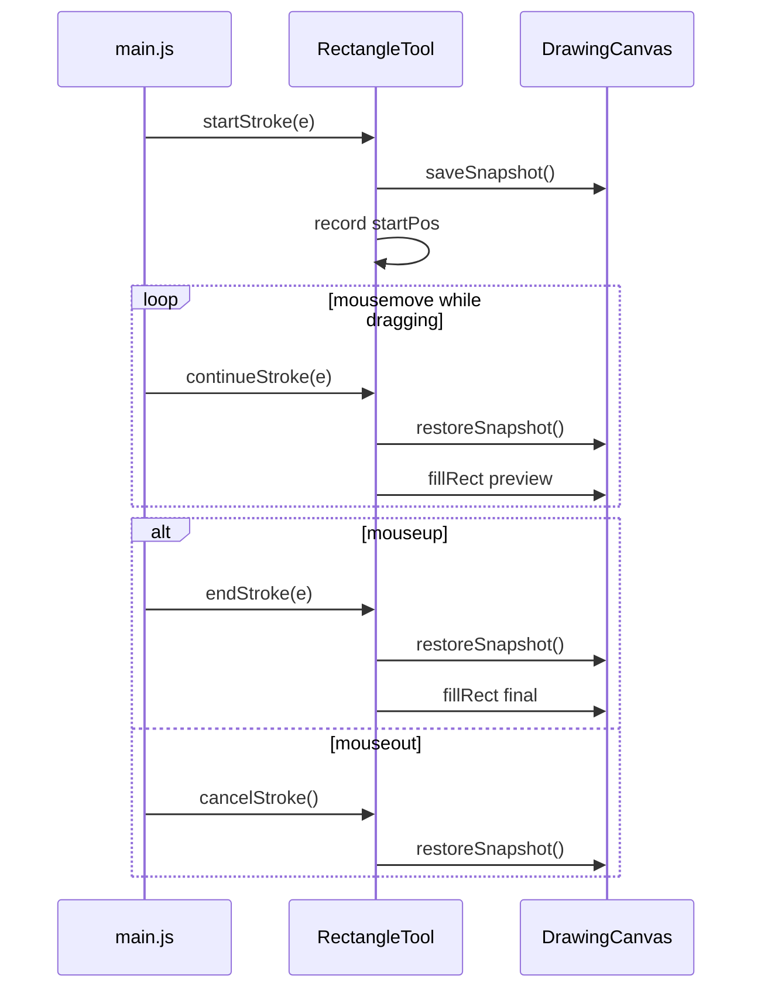

# Rectangle Drawing Tool Plan

## Refined requirements

See [requirements.md](file:///Users/elainezhang/Desktop/UNSW/PROJECTS/canva/sturdy-broccoli/requirements.md) — content to be written on execution:

```markdown
# Rectangle tool

## Interaction
- Add a **Rectangle** tool to the toolbar alongside Draw, Text, and Eraser.
- **Mousedown** on the canvas sets the first corner.
- **Drag** (mousemove while held) updates a live preview of the shape.
- **Mouseup** commits the final rectangle using the start point and release point as opposite corners.
- Drag direction does not matter — the shape is always axis-aligned.

## Appearance
- **Filled** rectangle (solid fill).
- **No stroke / border**.
- Fill colour: black (`#000000`), consistent with existing draw and text tools.

## Geometry
- The two pointer positions define opposite corners of an axis-aligned bounding box:
  - `x = min(x1, x2)`, `y = min(y1, y2)`
  - `width = |x2 - x1|`, `height = |y2 - y1|`

## Edge cases
- Click without dragging (zero width or height): draw nothing.
- Drag off the canvas (`mouseout` while drawing): cancel the in-progress shape; do not commit; restore the canvas to its pre-drag state.
- Releasing outside the canvas after dragging inside: commit using the last known drag position (via `mouseup` with event).

## Out of scope
- Undo, colour picker, stroke toggle, shape selection/editing, keyboard modifiers (e.g. Shift for square).
```

## Milestones

### Milestone 1 — Canvas foundation
**Goal:** Give the rectangle tool a way to preview without permanently painting on every mousemove.

**Tasks:**
- Add `saveSnapshot()` and `restoreSnapshot()` to [canvas.js](file:///Users/elainezhang/Desktop/UNSW/PROJECTS/canva/sturdy-broccoli/src/canvas.js) using `getImageData` / `putImageData`.
- Add `rectFromCorners(x1, y1, x2, y2)` helper for opposite-corner box math.

**Done when:** Canvas can save and restore its pixel state; rect helper returns correct `x`, `y`, `width`, `height` for any drag quadrant.

---

### Milestone 2 — Rectangle tool
**Goal:** Implement the drag-to-draw rectangle behaviour as a standalone tool class.

**Tasks:**
- Create [src/tools/rectangleTool.js](file:///Users/elainezhang/Desktop/UNSW/PROJECTS/canva/sturdy-broccoli/src/tools/rectangleTool.js) following the existing tool interface.
- `startStroke`: save snapshot, record start position.
- `continueStroke`: restore snapshot, draw preview via `fillRect` (fill only, no stroke).
- `endStroke(e)`: restore snapshot, commit final rect if non-zero size.
- `cancelStroke`: restore snapshot, discard without committing.

**Done when:** Tool class is complete in isolation (can be unit-tested mentally against the sequence diagram below).

---

### Milestone 3 — Integration
**Goal:** Wire the tool into the app and fix shared mouse lifecycle gaps.

**Tasks:**
- Register in [toolManager.js](file:///Users/elainezhang/Desktop/UNSW/PROJECTS/canva/sturdy-broccoli/src/toolManager.js): import, add to `tools` map, add toolbar entry `{ id: "rectangle", name: "Rectangle", icon: "⬜" }`.
- Update [main.js](file:///Users/elainezhang/Desktop/UNSW/PROJECTS/canva/sturdy-broccoli/src/main.js):
  - `mouseup`: call `endStroke(e)` when `isDrawing`.
  - `mouseout`: call `cancelStroke()` when the active tool supports it.

**Done when:** Rectangle button appears in toolbar; selecting it enables drag-to-draw on the canvas.

---

### Milestone 4 — Verify
**Goal:** Confirm requirements and no regressions.

**Manual checks:**
1. Toolbar — Rectangle button selectable and shows active state.
2. Draw — click-drag-release produces filled black rectangle, no border.
3. Quadrants — correct box when dragging up-left, down-right, etc.
4. Zero drag — click without move draws nothing.
5. Preview — shape updates during drag without ghost artifacts.
6. Cancel — mouseout mid-drag removes preview, nothing committed.
7. Regression — Draw, Text, Eraser still work; draw/eraser `endStroke` now runs on mouseup.

---

## Design choices

| Choice | Decision | Justification |
|--------|----------|---------------|
| New file vs extending draw tool | New `RectangleTool` class | Matches one-tool-per-file pattern; separates freehand from drag-to-shape logic. |
| Rectangle geometry | Opposite-corner bounding box | Matches requirements; works in all drag quadrants. |
| Live preview | Canvas snapshot restore | Minimal fit for pixel-based architecture; avoids permanent ghost shapes on mousemove. |
| Fill colour | Black (`#000000`) | Consistent with draw and text tools. |
| Commit on mouseup | Wire `endStroke(e)` in main.js | Required to commit on release; also fixes incomplete lifecycle for draw/eraser. |
| Cancel on mouseout | `cancelStroke()` restores snapshot | Prevents stuck preview; matches existing stop-drawing-on-mouseout behaviour. |

## Architecture



## Files touched

| File | Change |
|------|--------|
| [requirements.md](file:///Users/elainezhang/Desktop/UNSW/PROJECTS/canva/sturdy-broccoli/requirements.md) | Expand into full spec (on execution) |
| [src/canvas.js](file:///Users/elainezhang/Desktop/UNSW/PROJECTS/canva/sturdy-broccoli/src/canvas.js) | Snapshot + rect helper |
| [src/tools/rectangleTool.js](file:///Users/elainezhang/Desktop/UNSW/PROJECTS/canva/sturdy-broccoli/src/tools/rectangleTool.js) | **New** tool |
| [src/toolManager.js](file:///Users/elainezhang/Desktop/UNSW/PROJECTS/canva/sturdy-broccoli/src/toolManager.js) | Register tool + toolbar entry |
| [src/main.js](file:///Users/elainezhang/Desktop/UNSW/PROJECTS/canva/sturdy-broccoli/src/main.js) | `endStroke(e)` on mouseup; `cancelStroke()` on mouseout |

No changes to `index.html`, `styles.css`, or `package.json`.

## Out of scope

- Undo, scene graph, colour picker, stroke toggle, keyboard modifiers.
